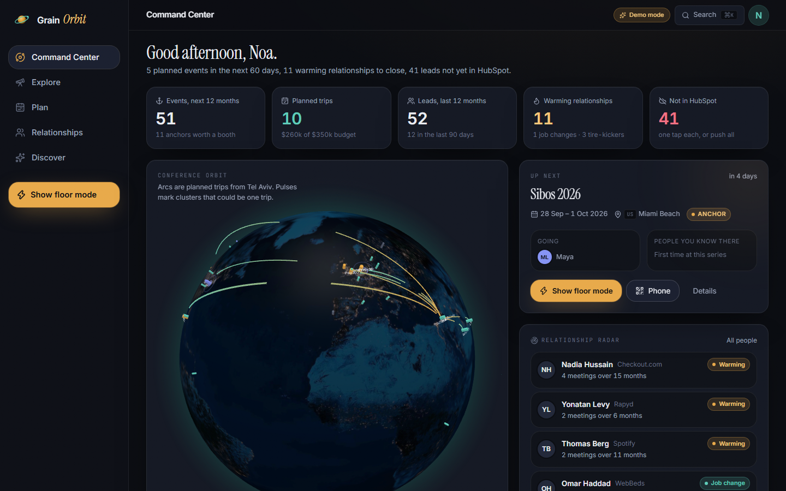
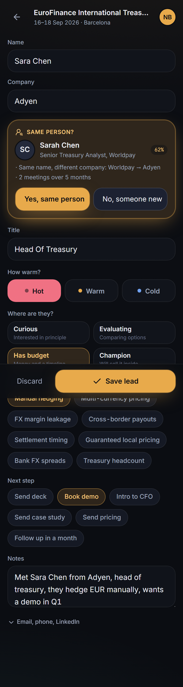
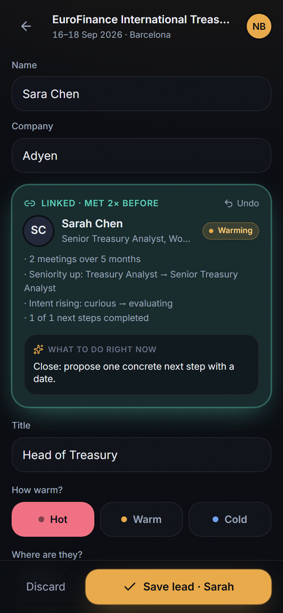
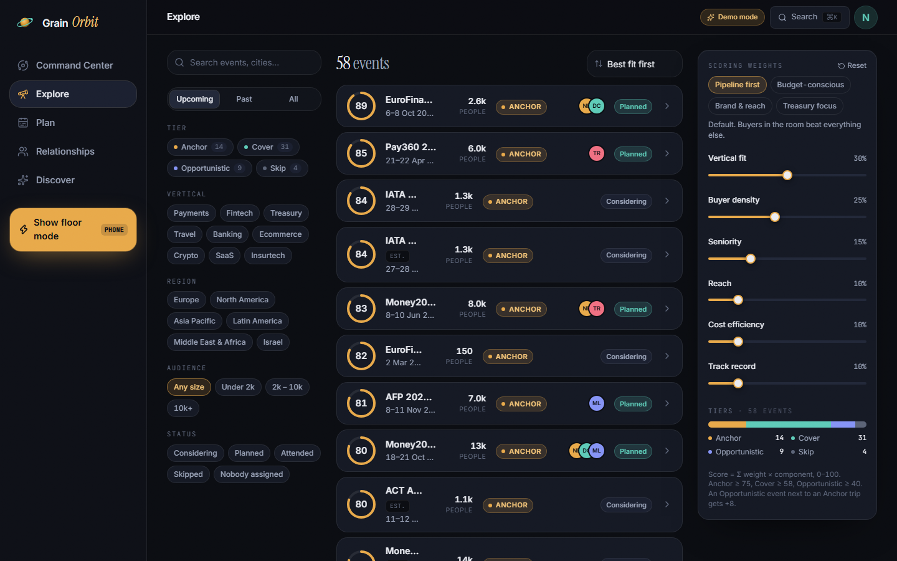
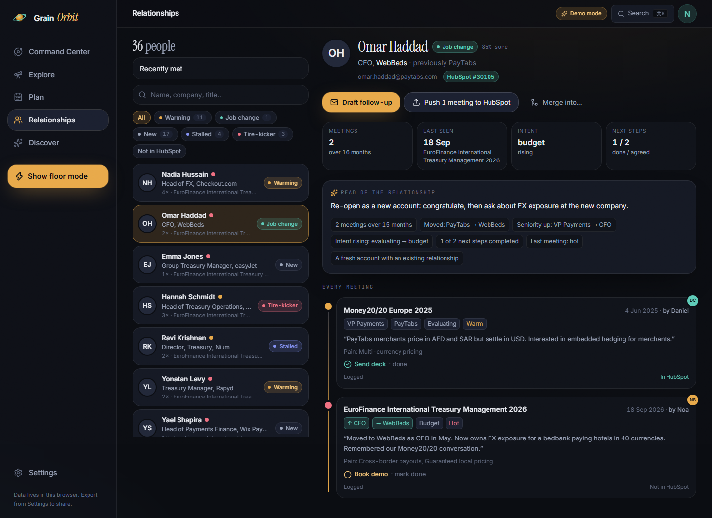
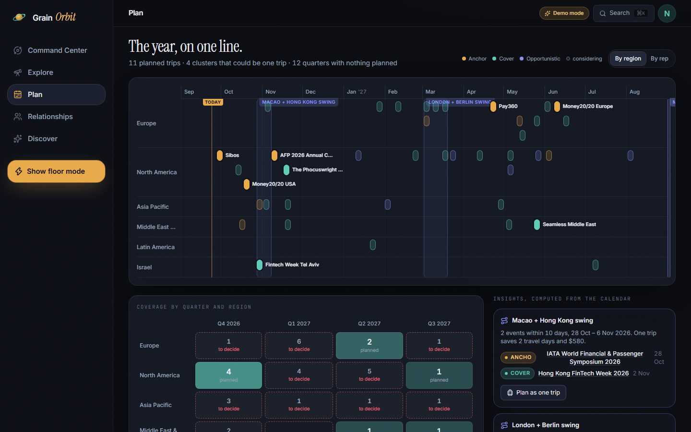

<p align="center">
  
</p>

<h1 align="center">Grain Orbit</h1>

<p align="center"><b>Conference intelligence for Grain's sales team.</b><br/>Know where to be, who to meet, and what to say.</p>

<p align="center">
  
  
  
  
  
</p>

<p align="center">
  
</p>

---

## What it is

Conferences are Grain's main pipeline channel, and the process lived in spreadsheets and Slack. Orbit puts it in one place, built for a salesperson on a busy floor rather than for an analyst at a desk:

- **A scored conference database.** Fifty-plus real payments, treasury, travel and fintech events with dates, cities, audiences, and an ICP-fit score you can argue with.
- **A plan for the year.** A twelve-month ribbon that shows where the team is, where it isn't, which events could be one trip, and which weeks collide.
- **Show-floor mode.** Open it on your phone, tap the mic, say who you met. The form fills itself and saves in one tap.
- **Relationship memory.** When the same person shows up at a second or third event, Orbit recognises them (even as "Bob" instead of "Robert", even after a job change) and tells you whether the relationship is warming or going nowhere.
- **HubSpot in one tap.** Every meeting becomes a contact plus a note, or a CSV that HubSpot imports as-is.

Every AI feature has a hand-written demo answer, so the live link works before anyone pastes a key.

## Try it

**Live:** _add your Vercel URL here after deploying_

A sixty-second tour:

1. **Command Center.** Spin the globe. Amber pins are events worth a booth, teal ones worth a walk-through. Arcs are planned trips from Tel Aviv. Click a pin.
2. **Explore.** Drag the scoring sliders on the right. Watch the list re-rank. Hover a score ring to see why an event scored what it scored.
3. **Plan.** Look for the purple halos on the ribbon: those are clusters that could be one trip. The insight cards on the right are computed from the calendar, not typed in.
4. **Show floor mode.** Tap the mic and say: _"Met Sarah Chen from Adyen, head of treasury, they hedge EUR manually, wants a demo in Q1."_ Then answer the "Same person?" card that appears.
5. **Relationships.** Open Priya Raman, then Omar Haddad. Same tool, opposite advice.
6. **Discover.** Ask for "treasury events in APAC in H1 2027". With a key it searches the web; without one it shows a sample.

<p align="center">
  
  &nbsp;&nbsp;
  
</p>

## Host it yourself in three steps

You do not need to be a developer.

1. **Fork this repository** on GitHub (the "Fork" button, top right).
2. **Import it on [vercel.com](https://vercel.com/new).** Pick the fork, keep every default, click Deploy. Vercel detects Vite and builds it.
3. **Optionally add two environment variables** in the Vercel project settings, so teammates get live AI and HubSpot without pasting keys themselves: `ANTHROPIC_API_KEY` and `HUBSPOT_ACCESS_TOKEN`. Redeploy once. Both remain optional; anyone can also paste their own keys in the app's Settings page, where they stay in that browser only.

Every later push to the fork redeploys automatically.

**Updating the conference list.** Either edit an event inside the app (dates, ICP inputs, status, reps all persist in your browser, and Settings can export the whole dataset as a file for a teammate to import), or add events with Discover. The bundled starting list lives in `src/data/seed/conferences.ts` and can be edited in GitHub's web editor; the next deploy ships it.

## How events are scored

<p align="center"></p>

The score is a weighted sum of six components, each visible with a one-line explanation. Weights are sliders, so the sales lead can change the methodology in a meeting rather than file a ticket. Four presets cover the usual arguments: pipeline first, budget-conscious, brand and reach, treasury focus.

| Component | Default weight | What it measures |
|---|---|---|
| Vertical fit | 30% | How much of the agenda is payments, treasury, FX and cross-border. Blends a hand estimate with the event's vertical tags (payments and treasury count most, general SaaS least). |
| Buyer density | 25% | The share of attendees who are PSPs, cross-border payment companies, travel wholesalers or treasurers. Grain's ICP, in one number. |
| Seniority | 15% | Whether CFOs, treasurers and heads of payments actually attend, or send their analysts. |
| Reach | 10% | Audience size on a logarithmic scale, so a 2,000-person treasury summit is not crushed by a 70,000-person tech festival. |
| Cost efficiency | 10% | Ticket plus estimated travel from home base (Tel Aviv by default). Cheaper scores higher. |
| Track record | 10% | Leads per event-day from past editions. Neutral when the team has never been. This is the feedback loop: logging leads this year changes next year's ranking. |

**Tiers.** 75 and above is an **Anchor** (booth or full team). 58 to 74 is **Cover** (one or two reps walk the floor). 40 to 57 is **Opportunistic** (only if it sits next to an Anchor trip). Below 40, **Skip**.

**The piggyback rule.** An Opportunistic event within seven days and 1,500 km of an Anchor gets eight points and a badge, because the marginal cost of a second event on the same trip is a day, not a flight.

**A worked example.** EuroFinance International Treasury Management scores 89: perfect agenda fit, nine in ten attendees are buyers, decision-makers attend, and the team took 34 leads and $1.4M of pipeline there last year. SaaStr Annual scores 35: ten thousand people, almost none of them treasurers.

**Why not machine learning.** Forty events and a handful of past outcomes is not a training set. A transparent model the sales lead can defend beats a black box, and the track-record term lets it learn from real results anyway.

## How it recognises the same person twice

<p align="center"></p>

Matching happens live while you type on the show floor, because that is the moment it matters: the person is standing in front of you.

**Normalisation first.** Names lose accents, honorifics and middle initials; nicknames and cross-language spellings fold to one form (Bob and Robert, Yonatan and Jonathan, Mueller and Müller, Levi and Levy). Company names lose "Ltd" and "N.V." and known aliases collapse (FIS Worldpay is Worldpay). Email addresses, phone numbers and LinkedIn URLs are normalised too.

**Then a cascade, strongest evidence first.**

| Evidence | Confidence | What the rep sees |
|---|---|---|
| Same email, LinkedIn or phone | 95 to 100% | Linked automatically, with Undo |
| Same name and same company | 90% | Linked automatically, with Undo |
| Same name, email domain is their company | 88% | Linked automatically, with Undo |
| Same person after a nickname or spelling fold, same company | 72% | "Same person?" with two big buttons, and the reason spelled out |
| Same name, different company | 62% | "Same person?" flagged as a possible job change |
| Same name, no company to compare | 55% | "Same person?" |

Above 85% the link is automatic. Between 50% and 85% the app asks one question. Below 50% it stays quiet. A name that three different people share (there are three James Smiths in the sample data) gets a penalty, so a common name never auto-links on its own.

**Edge cases the sample data exercises on purpose:** Sarah Chen becomes "S. Chen" and then "Sara Chen" at a new company; Bob Mueller is Robert Müller; Yonatan Levy meets Jonathan Levi; Maria Garcia Lopez is logged as Maria Garcia; Omar Haddad moves from a PSP to a bedbank and gets promoted; three James Smiths never merge; a surname alone never links. Every merge can be undone.

**From matches to meaning.** Counting meetings is not intelligence. Rules classify each relationship from the meeting history: number of touches, months elapsed, whether seniority rose, whether stated intent moved from curious toward budget, whether agreed next steps were actually done, and whether the company changed.

| Read | Rule | Nudge goal |
|---|---|---|
| Warming | Intent rising, seniority up, a next step completed, or last meeting hot | Close: propose one concrete next step with a date |
| Job change | Company changed and seniority went up | Re-open as a new account |
| Tire-kicker | Three or more meetings over nine months, never past "evaluating", no next step ever done | Qualify or park: ask the budget question directly |
| Stalled | Two or more meetings, nothing moved | Re-open with something new, not another pitch |
| New | One meeting | Follow up within 48 hours |

**Where nudges appear.** Inside the capture form the moment a match fires, on an event's page as "people you know here", and in a five-item radar on the Command Center. Nowhere else. Too aggressive is noise; too subtle is invisible.

## The AI features, and why AI

| Feature | What it does | Why a model is the right tool |
|---|---|---|
| Voice or text to lead | Turns "met Sarah from a dyen, head of treasury, hedges EUR manually" into name, company, title, warmth, stage, pain points and next step, and normalises the spelling to a known contact | Fragments on a loud floor are a language problem, not a form problem. It even fixes "a dyen" to Adyen. |
| Business card to lead | Reads a card photo into the same fields | Vision plus layout understanding |
| Relationship read | Two sentences on where the relationship stands, one concrete nudge, one spoken opener | The rules decide the class; the model explains it in a way a rep reads in five seconds |
| Follow-up draft | An email in three tones, from the notes, with one ask | Tone and specificity are where templates fail |
| Pre-conference brief | Who to meet, what to hunt for, three talking points, a checklist | Synthesis across the event, the known contacts and recent pains |
| Discovery | Searches the web for events not yet in the list, returns them scored and sourced, dates flagged when unconfirmed | Unstructured web to structured, scored records |

All six run on Claude through a tiny proxy so keys never sit in a URL. Every output is structured (a schema, not prose), so nothing is parsed by hand. Without a key, each feature shows a hand-written demo answer, labelled as such.

## Connecting HubSpot

1. In HubSpot, open Settings, then Integrations, then Private Apps, and create one.
2. Give it these scopes: `crm.objects.contacts.read`, `crm.objects.contacts.write`, `crm.objects.companies.read`, `crm.objects.companies.write`, `crm.schemas.contacts.write`.
3. Copy the token (it starts with `pat-`) into Orbit's Settings page and press Test connection.

Pushing a meeting finds the contact by email (or by name and company), creates or updates it, and attaches a note with the event, date, warmth, stage, pain points, next step and your notes. You can preview the exact payload before sending, push one contact or everything unsynced, and see per-meeting status. Without a token, "Export CSV for import" produces a file HubSpot's importer accepts directly.

## Your data

Everything lives in your browser's storage. There is no server database. Settings can export the whole dataset as a JSON file, import a teammate's, or reset to the sample data. Keys and tokens are stored in the browser only and sent to the proxy per request; the proxy forwards them to Anthropic or HubSpot and keeps nothing.

<p align="center"></p>

## Beyond the brief

Things the assignment did not ask for, added because a salesperson would want them:

- **Pre-conference briefs**, written from your own notes about the people attending.
- **Holiday clashes for a Tel Aviv team.** Money20/20 USA 2027 runs during Sukkot. The planner says so.
- **Owed follow-ups** on the Command Center: next steps agreed and not done, oldest first.
- **Trip clusters with honest maths.** "One trip saves two travel days" or "saves one travel day but costs $300 more in hotel", computed, not assumed.
- **Calendar export** for one event or every planned trip.
- **A QR code** on the Command Center that opens show-floor mode on your phone.
- **Installable on a phone**, with the app shell working offline. Venue wifi is always terrible.
- **Command palette** (Cmd or Ctrl plus K) to jump to any event, person or action.
- **A budget bar** against an annual number you set.
- **Track record feeds the score**, so logging leads this year changes next year's plan.

## How I built this with AI

_Draft, in the candidate's voice. Edit before publishing._

I planned the whole thing in a conversation before writing code: the brief explained back, the decisions listed, a written plan committed to the repo first. The plan became the contract for the build.

Where AI helped most: four research agents verified real dates for fifty conferences in parallel, with sources, while the domain engine was being written. The matching cascade, its tests and the seed data that exercises every edge case came out of one pass. The structured-output prompts for extraction and relationship reads worked on the first live call.

Where it got in the way: the first transcript parser was case-sensitive and missed "Met Sarah" until a test caught it. The colour validator flagged the tier palette's lightness, and I decided to keep the brand colours because every use has a text label. The web-search discovery feature took two minutes on the first try and needed streaming and a smaller search budget. A HubSpot token got truncated in a copy-paste and cost twenty minutes.

## What I'd build next

- A shared backend (Supabase) so a lead captured on the phone appears on a colleague's laptop without export and import.
- Post-conference debriefs: leads, cost per lead and pipeline per event, feeding the track-record score automatically.
- HubSpot two-way sync: pull deal stages back so the relationship read knows when something closed.
- Trip builder: turn a cluster into an itinerary with flights and nights, exportable to the team calendar.
- A weekly digest the AI writes for Slack: what moved, who is owed, what is coming.
- Team load balancing suggestions when one rep is stretched across three weeks.

---

<details>
<summary><b>For developers</b></summary>

Vite 8, React 19, TypeScript, Tailwind 4, Motion, react-globe.gl, Zustand (persisted to localStorage), react-router, Vitest. Two Vercel serverless functions (`api/ai.ts`, `api/hubspot.ts`) proxy Anthropic and HubSpot; a Vite plugin mounts the same handlers locally, so `npm run dev` needs nothing else.

```bash
npm install
cp .env.example .env.local   # optional server-side fallback keys
npm run dev                  # http://localhost:5173
npm test                     # 73 unit tests: scoring, clustering, matching, arcs, seed integrity, HubSpot mapping
npm run typecheck
npm run build
```

Layout: `src/domain` is pure, tested logic (scoring, clustering, matching, arcs, holidays, HubSpot mapping). `src/data/seed` holds the sample conferences, people and meetings plus the demo AI answers. `api/_lib/features.ts` holds every AI prompt and schema; `api/_lib/grainContext.ts` describes the company to the model. `docs/PLAN.md` is the build plan the implementation followed. `scripts/shot.mjs` takes verification screenshots, `scripts/rank.ts` prints the seed ranking.

</details>
